# mcp-jenkins-adapter

This project demonstrates a fully containerized MCP client-server application that interacts with Jenkins via an API token, and leverages OpenAI for plugging in AI-powered functionalities in Jenkins.

---

## Project Overview

Main feature of the project is using OpenAI through the MCP Client for processing or summarizing Jenkins data.

- **Jenkins** – Main CI/CD server, configured with functional MCP user for automated job operations.
- **MCP Server** – provides AI-powered tools, connects to Jenkins and exposes a SSE endpoint for clients.
- **MCP Client** – Handles interaction with OpenAI and connects to MCP server via SSE, bridging those services together. OpenAI functionality is accessed through MCP Client.
- **OpenAI** – Using provided AI-powered tools to trigger jobs and process Jenkins job data.

The MCP server uses a **Jenkins API token** generated at Jenkins startup.

---

## Architecture Overview

```mermaid
flowchart TB
    %% Jenkins Container
    subgraph Jenkins_Container["Jenkins Container"]
        JCore["🖥️ Jenkins Core"]
        JPlugins["🔌 Plugins (optional)"]
    end

    %% MCP Server Container
    subgraph MCP_Server_Container["MCP Server Container"]
        MCPServer["🛠️ MCP Server"]
    end

    %% MCP Client Container
    subgraph MCP_Client_Container["MCP Client Container"]
        MCPClient["MCP Client"]
    end

    %% OpenAI External Service
    subgraph OpenAI_Service["OpenAI API (External)"]
        OpenAI["🤖 AI API"]
    end

    %% Connections
    MCPServer -->|Triggers jobs / Queries status| JCore
    JCore -->|Job status / Console log| MCPServer

    MCPClient <-->|SSE / AI Tools| MCPServer
    MCPClient <-->|AI requests / AI Tools| OpenAI
```



---

## Folder Structure

```
jenkins-mcp-adapter/
├── docker-compose.yaml
├── Dockerfile.jenkins
├── init.groovy.d
│   ├── create-users.groovy
│   └── seed-job.groovy
├── LICENSE
├── mcp-client
│   ├── Dockerfile
│   ├── go.mod
│   ├── go.sum
│   ├── main.go
├── mcp-server
│   ├── Dockerfile
│   ├── go.mod
│   ├── go.sum
│   └── main.go
└── README.md
```

---

## Prerequisites

- Podman/Docker
- Podman/Docker Compose
- `.env` file with required variables (see below)
- OpenAI API key

---

## Environment Variables (`.env`)

Create a `.env` file in the project root with at least the following:

```env
JENKINS_ADMIN_USER=<user>
JENKINS_ADMIN_PASS=<password>
JENKINS_MCP_USER=<mcp_user>
JENKINS_MCP_PASS=<mcp_password>
OPENAI_API_KEY=<your_openai_api_key>
```

---

## Running the Stack

```bash
# First initialize jenkins server to get mcp-user and API key created
$ podman-compose up --build -d jenkins
# Create dir in root of repository and file where token will be stored
$ mkdir -p ./jenkins-secrets
$ touch ./jenkins-secrets/mcp-user.token
# Get API token from jenkins and store it in mcp-user.token file
$ podman-compose exec jenkins cat /var/jenkins_home/secrets/mcp-user.token
# Get rest of services running
$ podman-compose up --build -d
```

---

## Accessing Services

- Jenkins UI: http://localhost:8082/jenkins
- MCP Server SSE endpoint: http://localhost:8081/sse
- MCP Client:
```bash
$ podman-compose exec mcp-client sh # opens terminal in mcp-client container
$ mcp-client # starts client session
MCP initialized. Server: {Name:jenkins-mcp Version:1.0.0}
Jenkins LLM Bridge started. Type your prompts:
> start demo-job # request example forwarded to OpenAI
```

---

## Processing Jenkins Jobs Data

MCP server exposes tools to trigger Jenkins jobs and process build data:

- `trigger_job` – Trigger a job by name, optionally with parameters.

- `get_build_status` – Get the latest build status for a job.

- `get_console_log` – Retrieve console log for a specific build number.

- `analyze_logs` - A helper function that gathers logs from Jenkins via the MCP Server, transforms them into mcp.Content, and then sends them to OpenAI for analysis.

    Role in architecture: Not exposed as a public MCP tool; instead, it’s a private “bridge” feature that enriches what the MCP client can request.

---

## Notes / Best Practices

- Always ensure jenkins-secrets/mcp-user.token exists before starting the client-server stack.

- `.env` values are loaded dynamically for security.

- Podman Compose handles service dependencies, but Jenkins must initialize before MCP server.

- Avoid storing sensitive credentials directly in docker-compose.yml.

---

## Stopping the Stack
```bash
$ podman-compose down
```
This will stop all containers while preserving the volumes (jenkins_home).
